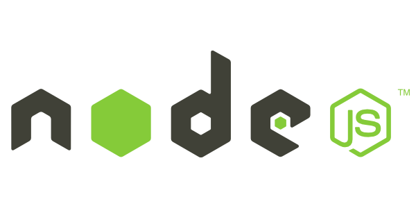
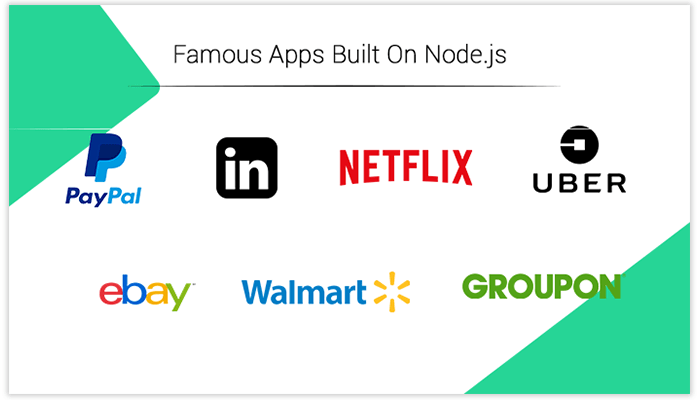

# 💚Node.js - 5조

## 📌Index

- [Node.js 란?](#nodejs-란)
- [Node.js의 동작원리](#nodejs의-동작원리)
- [Node.js 의 특징](#nodejs-의-특징)
- [Node.js 의 장단점](#nodejs-의-장단점)
- [Node.js 를 사용하는 서비스들](#nodejs-를-사용하는-서비스들)
- [Node.js 의 TMI](#nodejs-의-tmi)

------

## Node.js 란?

Node.js 는 서버사이드 자바스크립트이며 구글의 자바스크립트 엔진인 V8을 기반으로 구성된 일종의 소프트웨어 시스템입니다.

이벤트 기반으로 개발이 가능하며 Non-Blocking I/O를 지원하기 때문에 비동기식 프로그래밍이 가능합니다. 이 때문에 I/O 부하가 심한 대규모 서비스를 개발하기 적합하다고 할 수 있습니다. 또한 자바스크립트의 표준라이브러리 프로젝트인 CommonJS의 스펙을 따르고 있습니다.

사실 노드에서 처음 등장한 것과 같이 느껴지는 비동기 프로그래밍 모델은 최근 등장한 새로운 개념은 아닙니다. 실제로 다른 프로그래밍 언어에서 비슷한 환경을 찾아볼 수 있는데, 대표적으로는 Python의 Twisted, Perl의 Perl Object Environment, C언어의 libevent, Ruby의 EventMachine 등이 있습니다.

## Node.js의 동작원리

## Node.js 의 특징

## Node.js 의 장단점

## Node.js 를 사용하는 서비스들

노드는 다른 언어들 만큼 등장한 지 오래되지 않았음에도, 이를 실제로 적용한 기업들의 사례가 늘어나고 있습니다. 노드의 실제 동작 방식을 알아보기에 앞서 노드를 사용하는 서비스 몇 개에 대해서 간단히 알아보겠습니다.

**Walmart**

세계적으로 유명한 대형마트인 월마트에서도 자신들의 모바일 앱의 백엔드 서비스를 위해서 노드를 활용하고 있습니다. 주로 하이브리드 앱 스타일로 구성하고, 기능 대부분은 노드를 통해 서버 사이드에서 작동하도록 했습니다.

**LinkedIn**

유명한 SNS 서비스 중 하나인 LinkedIn은 자사의 모바일 웹 관련 서비스를 위해서 노드와 mongoDB를 사용하고 있습니다. LinkedIn은 노드 사용의 대표적인 사례로 자신들의 메인 서비스를 Ruby On Rails로 돌릴 때는 15대의 서버에서 15개의 인스턴스로 돌리다가, **노드로 개발한 뒤에는 두 배에 달하는 트래픽을 단지 4개의 인스턴스만으로도 운영이 가능**하다고 했습니다. 또한 LinkedIn의 인턴십을 수행하던 사람들이 24시간동안의 핵데이HackDay를 통해 노드를 이용하여 VNC 클라이언트를 구현한 재미있는 케이스도 있습니다.

**Cloud9 IDE**

Cloud9 IDE는 가장 널리 쓰이고 있는 웹기반 통합개발환경으로서 웹 브라우저에서 노드 기반의 애플리케이션을 쉽게 개발할 수 있도록 해주는 서비스입니다. 노드로 웹 애플리케이션을 개발할 수 있는 환경을 제공하지만, 그 서비스 자체도 노드를 이용하여 개발되어 있습니다. 사용자와 직접 상호 작용하는 프론트엔드 부분을 HTML5/CSS/Javascript로 제작함과 동시에 서버에서 실질적으로 작업을 수행하는 백엔드에서도 노드를 사용하여 하나의 언어로 전체 서비스를 개발하였습니다. 

## Node.js 의 TMI

